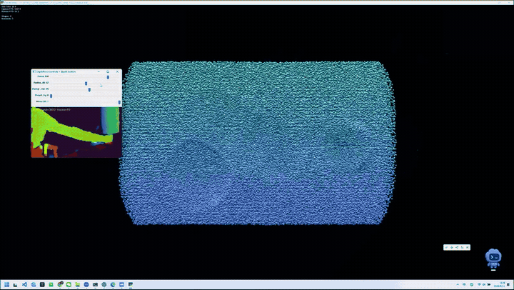

# DepthForce

DepthForce is a native-Windows Python MVP in which a persistent foreground silhouette from an Intel RealSense D435i becomes a tracked 3D force field that repels a dense NVIDIA Warp particle volume. The particle state remains on the CUDA device; only the compact force representation is processed on the CPU and uploaded each camera frame.

## Demo



The 10-second preview shows persistent arm tracking, lateral particle displacement, and smooth recovery. [Download the complete 65-second D435i experiment (MP4, 8.6 MB)](assets/depthforce-demo-github.mp4?raw=1). The full-resolution master stays outside Git history.

The synthetic mode is fully usable without a camera:

```powershell
python main.py --synthetic
```

## Hardware and platform

- Windows 10/11, native (not WSL for camera access)
- NVIDIA CUDA-capable GPU; the target/test GPU is an RTX 3060 Laptop GPU with 6 GB VRAM
- Intel RealSense D435i connected through a USB 3 port for live mode
- A working OpenGL display context

Tested locally through 2026-09-10 with:

- Windows 11 23H2 (build 22631)
- Python 3.10.6 in `.venv`
- NVIDIA driver 560.70 (driver reports CUDA 12.6)
- CUDA toolkit 12.4 installed; Warp 1.16.0 uses its bundled CUDA 12.9 runtime toolchain
- `warp-lang` 1.16.0, `pyrealsense2` 2.58.3.10794, NumPy 2.2.6, Pyglet 2.1.11, OpenCV 4.12.0
- RealSense D435i firmware 5.17.3.10 over USB 3.2; verified 640x360 depth at 59.9 device FPS

The D435i live stream, motion extraction, and integrated particle interaction have now been validated on the target machine.

## Setup

Python 3.10 is used because it is a conservative shared target for the current Warp and RealSense Windows wheels.

```powershell
py -3.10 -m venv .venv
.\.venv\Scripts\Activate.ps1
python -m pip install -r requirements.txt
```

No global Python environment is modified.

### Windows non-ASCII paths

Warp 1.16's NVRTC compiler can fail when its temp or header paths contain non-ASCII characters. `warp_env.py` detects this, moves Warp's compiler cache/temp files to `C:\temp\depthforce-warp`, and mirrors only the small Warp header tree there. It does not move the virtual environment or change the installed package.

If `C:\temp` is absent or not writable, choose any writable ASCII-only directory before launching:

```powershell
New-Item -ItemType Directory -Force C:\warp-temp
$env:TEMP = "C:\warp-temp"
$env:TMP = "C:\warp-temp"
$env:WARP_CACHE_PATH = "C:\warp-temp\cache"
```

## Staged validation

Run these in order:

```powershell
# A: compile and execute a tiny CUDA kernel
python scripts\test_warp.py

# B: static Warp OpenGL rendering, 150k GPU particles
python scripts\test_renderer.py

# C: force kernel, worst-case 96-source benchmark and displacement check
python scripts\test_simulation.py

# D: enumerate the D435i and stream filtered 640x360 @ 60 FPS depth
python scripts\test_realsense.py

# E/F: persistent foreground, XYZ velocity, fade, and preset tests
python scripts\test_depth_motion.py
```

`test_realsense.py` exits with a clear `NO DEVICE` result when a camera is not present.

## Run

On Windows, double-click `启动DepthForce.cmd` in the project folder for the recommended Balanced mode with camera controls.

Without a camera:

```powershell
python main.py --synthetic
```

With a connected D435i:

```powershell
python main.py
```

Useful diagnostic variants:

```powershell
python main.py --synthetic --debug
python main.py --debug --camera-debug
python main.py --preset punchy
python main.py --synthetic --particles 100000
python main.py --force-strength 60 --force-radius 0.90 --motion-threshold 0.040 --mirror
```

The defaults are 150,000 particles, `cuda:0`, a maximized particle window that keeps the normal title bar and taskbar, and the smooth `balanced` interaction preset. Launch with `--no-maximized` to keep the original 1280x800 window size. `--frames N` is available for repeatable benchmarks and automated smoke tests.

Live mode learns the empty scene for roughly the first third of a second. Keep hands and body out of view while it starts. Press `R`, briefly clear the camera view, and let it relearn whenever the camera or background moves.

| Preset | Feel |
|---|---|
| `balanced` | Smoother tracking, longer fade, controlled directional force |
| `punchy` | Faster response, larger radius, stronger XYZ directional push |

## Controls

| Key | Action |
|---|---|
| `ESC` / `Q` | Quit |
| `R` | Reset particles and relearn the empty depth background |
| `SPACE` | Enable/disable camera or synthetic interaction |
| `D` | Toggle renderer/live console diagnostics |
| `M` | Toggle horizontal mirror interaction |
| `1` | Select Balanced |
| `2` | Select Punchy |
| `+` / `-` | Increase/decrease force strength |

With `--camera-debug`, the OpenCV window shows the filtered depth, green foreground mask, background-learning status, and active track count. It provides live controls for the Balanced/Punchy preset, force, radius, foreground gap, and mirror. Tune them while moving, then press `D` to hide diagnostics for a clean recording. The primary output remains the Warp particle window.

Horizontal mirror behavior is enabled by default because it feels natural when a person faces the camera: moving to the right pushes particles on the right. Use `M` or `--no-mirror` for literal camera-view coordinates.

## How it works

```text
D435i 640x360 depth @ 60 FPS + Hand visual preset
        |
        v
light edge-preserving spatial filter (no temporal filter)
        |
        v
160x90 robust metric depth -> persistent foreground background subtraction
        |
        v
connected-component cleanup -> persistent local 3D tracks + XYZ velocity
        |
        v
small CPU-to-GPU source upload
        |
        v
150k GPU particles: repulsion + inertia + damping + spring-to-rest
        |
        v
Warp OpenGLRenderer consumes the live Warp position array
```

The interaction range is 0.16-1.8 m. A foreground remains active even while nearly stationary, so slow arm movements hold particles open instead of disappearing. Each local source is deprojected with the camera intrinsics; matched positions generate metric XYZ travel direction, with additional strength for motion toward the camera. Tracks glide, briefly extrapolate, and fade instead of popping off.

Repository layout:

```text
main.py                         application/render loop and controls
config.py                       visual, simulation, camera, and motion constants
camera/realsense.py             native RealSense depth wrapper
interaction/depth_motion.py     background model, foreground mask, XYZ source tracking
simulation/kernels.py           Warp integration/reset kernels
simulation/particles.py         GPU state and small source uploads
rendering.py                    low-detail particle geometry compatibility
scripts/                        staged hardware and subsystem tests
```

## Measured performance

On the RTX 3060 Laptop GPU above:

- Static 150k renderer test: **108.7 average FPS** over 180 frames.
- Integrated 150k synthetic demo: **119–122 steady-state FPS**; **92.8 average FPS** over 600 frames when including the first 1.47-second kernel compilation.
- Current D435i profile: **59.9 device FPS** with the camera reporting the `Hand` preset active.
- Current integrated 360-frame smoke test: **295.2 average render FPS** with filtered camera interaction at **59.9 FPS**.
- 150k particles against the maximum 96 force sources: approximately **7,600 simulation steps/s** in the current synchronized regression test.

Warp 1.16 currently ignores `render_points(..., as_spheres=False)` and otherwise instantiates a 32x32 sphere (2,048 triangles) for each tiny point. `rendering.py` changes only this renderer instance to a 4x6 mesh (48 triangles), improving the measured static result from 8.4 to 108.7 FPS. The particle position buffer still flows directly from Warp CUDA to the renderer's registered OpenGL buffer. Initialization uses the already-existing CPU rest positions, so there is no full GPU particle readback in the real-time loop.

## Current limitations

- The camera must see the empty installation scene briefly at startup or after `R`; moving the camera requires background relearning.
- Foreground tracking is geometric depth tracking, not semantic hand recognition. Hands, arms, bodies, and other closer objects can all interact.
- Camera-space to scene-space calibration is intentionally simple. The default 0.16-1.8 m interaction range and scene scale may need small adjustments for the installation distance.
- Particles use one visual color field and do not use RGB camera color.
- The effect is an artistic spring/repulsion system, not a physically accurate fluid simulation.

The single best next visual improvement is a short GPU trail/afterimage pass. It would make hand swipes and temporary cavities much easier to read without adding perception models or changing the camera pipeline.

Future extensions can include vortex/attract modes, shockwaves, depth echo, RGB-colored particles, semantic hand-only masking, SPH/fluid behavior, and audio reactivity.
